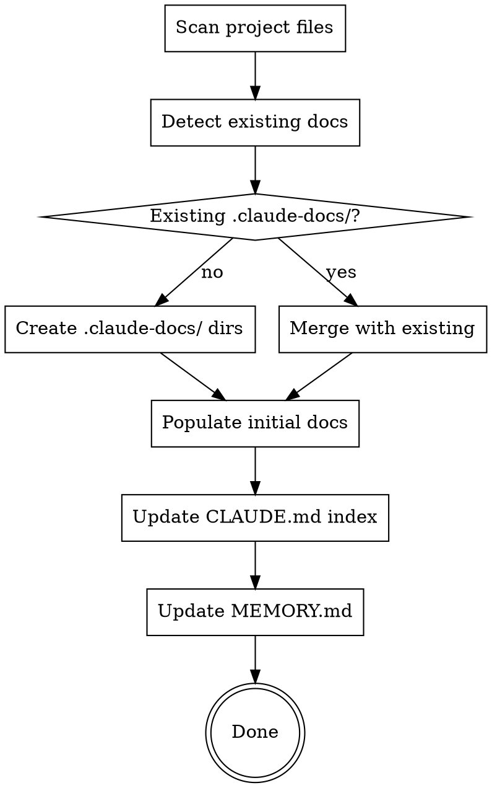

# Bootstrap Project Documentation

## Overview

Discover a project's architecture, tech stack, and existing docs, then scaffold a structured `.claude-docs/` documentation system. Run once per project or when major architectural changes warrant a refresh.

<HARD-GATE>
You MUST complete a full project scan before creating any files. Do NOT assume the tech stack, framework, or architecture. Discover everything from actual project files.
</HARD-GATE>

## Checklist

You MUST create a task for each item and complete them in order:

1. **Scan project files** — identify tech stack from manifest files (package.json, pyproject.toml, Cargo.toml, go.mod, docker-compose.yml, etc.)
2. **Detect existing documentation** — find README, CLAUDE.md, .claude-docs/, wiki/, docs/, any markdown files
3. **Create .claude-docs/ structure** — 4 standard directories: conventions/, reference/, tasks/, troubleshoot/
4. **Populate initial documentation** — architecture overview, tech stack, directory structure from discoveries
5. **Update CLAUDE.md index** — add Documentation Index section (or create CLAUDE.md if missing)
6. **Update MEMORY.md** — add project structure summary to persistent memory

## Process Flow



## Step 1: Scan Project Files

Search for manifest/config files to identify the tech stack:

| File | Indicates |
|------|-----------|
| `package.json` | Node.js / JavaScript / TypeScript |
| `pyproject.toml`, `setup.py`, `requirements.txt` | Python |
| `Cargo.toml` | Rust |
| `go.mod` | Go |
| `Gemfile` | Ruby |
| `docker-compose.yml`, `Dockerfile` | Containerized |
| `tsconfig.json` | TypeScript |
| `.github/workflows/` | CI/CD via GitHub Actions |

Also check:
- Directory structure (src/, app/, lib/, tests/)
- Entry points (main.py, index.ts, main.go)
- Framework indicators (next.config.js, vite.config.ts, manage.py, Fastfile)

**For monorepos:** Identify each package/workspace. Each may need its own `.claude-docs/` and `CLAUDE.md`.

## Step 2: Detect Existing Documentation

Search for all documentation already present:

- `README.md` (root and subdirectories)
- `CLAUDE.md` (root and subdirectories)
- `.claude-docs/` directories
- `docs/`, `wiki/`, `documentation/`
- Any `.md` files with useful project knowledge

**NEVER overwrite existing documentation.** If `.claude-docs/` already exists, only add missing pieces.

## Step 3: Create .claude-docs/ Structure

Create the 4 standard directories:

```
.claude-docs/
  conventions/    # How-to: coding standards, style guides, workflow rules
  reference/      # What-is: architecture, tech stack, directory layout
  tasks/          # Step-by-step: guides for common operations
  troubleshoot/   # Fix-it: known issues and solutions
```

**For monorepos:** Create stack-specific `.claude-docs/` under each package:
```
packages/frontend/.claude-docs/
packages/backend/.claude-docs/
```

## Step 4: Populate Initial Documentation

Create these starter files from your scan discoveries:

**reference/architecture.md** — System design, component relationships, data flow
**reference/tech-stack.md** — Technologies, versions, key dependencies
**reference/directory-structure.md** — Project layout with purpose of each directory

**conventions/code-style.md** — Detected linter configs, formatting rules, naming conventions
**conventions/git-workflow.md** — Branch naming, commit format (detect from git log)

Each file must be:
- Under 200 lines
- Named semantically (by topic, not by date)
- Based on actual project evidence, not assumptions

## Step 5: Update CLAUDE.md Index

Add a Documentation Index section to the nearest `CLAUDE.md`. Create `CLAUDE.md` if it doesn't exist.

Format:
```markdown
## Documentation Index

### .claude-docs/reference/
- [architecture.md](.claude-docs/reference/architecture.md) - System design, data flow
- [tech-stack.md](.claude-docs/reference/tech-stack.md) - Technologies and versions
- [directory-structure.md](.claude-docs/reference/directory-structure.md) - Project layout

### .claude-docs/conventions/
- [code-style.md](.claude-docs/conventions/code-style.md) - Coding standards
- [git-workflow.md](.claude-docs/conventions/git-workflow.md) - Branching, commits
```

Use table format with Path | Purpose columns for larger indexes.

## Step 6: Update MEMORY.md

Add a project structure summary to MEMORY.md (the persistent memory file at `~/.claude/projects/.../memory/MEMORY.md`):

- Project name and brief description
- Tech stack summary
- Key file locations
- Any critical conventions discovered

Keep the total MEMORY.md under 200 lines.

## Conventions

| Rule | Detail |
|------|--------|
| Max 200 lines | Any doc file exceeding 200 lines must be split |
| Semantic naming | `error-handling.md` not `2026-02-17-errors.md` |
| Split naming | `error-handling.md` -> `error-handling-http.md`, `error-handling-db.md` |
| Never overwrite | Preserve all existing documentation |
| Evidence-based | Only document what you can verify from project files |

## Red Flags

These thoughts mean STOP — you're skipping the scan:

| Thought | Reality |
|---------|---------|
| "I already know this stack" | Scan anyway. Projects vary within stacks. |
| "The README covers everything" | READMEs serve different audiences than .claude-docs/. |
| "I'll fill in the docs later" | Incomplete docs now beats perfect docs never. |
| "This project is too simple" | Simple projects still benefit from structure. |
| "I'll just create the dirs" | Empty dirs are useless. Populate with actual findings. |
