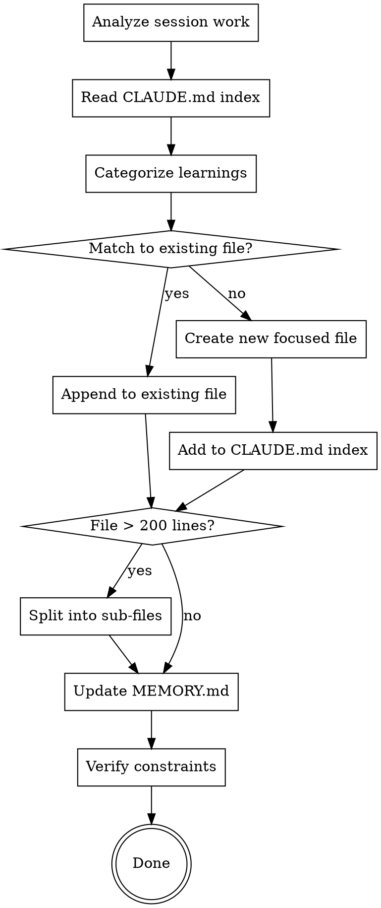

# Capture Session Learnings

## Overview

Capture session learnings and route them to the right documentation files. Reads the CLAUDE.md index to discover where docs live, then writes learnings to semantically matching files.

<HARD-GATE>
You MUST read the CLAUDE.md Documentation Index before writing to any file. No blind writes. If CLAUDE.md has no index, run project-memory:bootstrap first.
</HARD-GATE>

## Checklist

You MUST create a task for each item and complete them in order:

1. **Summarize session learnings** — root cause, solution, patterns, pitfalls discovered
2. **Read CLAUDE.md Documentation Index** — discover where all docs live
3. **Categorize each learning** — convention, pitfall, architecture, workflow, troubleshooting
4. **Route each learning to best target file** — match semantically to existing docs
5. **Create new files if no match** — focused file + add to CLAUDE.md index
6. **Split oversized files** — any file exceeding 200 lines gets split
7. **Update MEMORY.md** — compressed summary in "Recent Work" + numbered pitfalls
8. **Verify constraints** — MEMORY.md <200 lines, all files <200 lines, new files indexed

## Process Flow



## Step 1: Analyze Session Work

Review the conversation to extract:

- **Root Cause**: What was the underlying problem?
- **Solution Applied**: What fix was implemented?
- **Pattern/Anti-Pattern**: What generalizable pattern emerged?
- **Prevention**: How can this be avoided in the future?
- **Code Examples**: Any BAD/GOOD patterns worth documenting?

## Step 2: Read CLAUDE.md Documentation Index

Find and read ALL CLAUDE.md files in the project:
- Root `CLAUDE.md`
- Subdirectory `CLAUDE.md` files (e.g., `backend/CLAUDE.md`, `frontend/CLAUDE.md`)

Extract the Documentation Index sections to build a map of:
- Which `.claude-docs/` directories exist
- What files are in each directory
- What topics each file covers

This map is your routing table. Every learning must go through this map.

## Step 3: Categorize Each Learning

Assign each learning to a category:

| Category | Target Directory | Examples |
|----------|-----------------|----------|
| Convention | `conventions/` | Code style, naming, error handling patterns |
| Architecture | `reference/` | System design, data flow, component relationships |
| Workflow | tasks/ or conventions/ | Development process, deployment, testing |
| Troubleshooting | `troubleshoot/` | Bug fixes, environment issues, known gotchas |
| Pitfall | MEMORY.md | One-line warnings for common mistakes |

## Step 4: Route to Best Target File

For each learning, find the semantically closest file from the CLAUDE.md index:

1. **Read the target file** to confirm the learning fits
2. **Find the right section** within the file
3. **Append** the learning matching the file's existing style
4. Include BAD/GOOD code examples where the file already uses them
5. Update "Last Updated" dates if present

**Routing priority:**
1. Exact topic match (e.g., error handling lesson -> `error-handling.md`)
2. Broader topic match (e.g., HTTP error -> `error-handling.md` or `api-conventions.md`)
3. Category match (e.g., new convention -> any file in `conventions/`)
4. No match -> create new file (Step 5)

## Step 5: Create New Files If No Match

When a learning doesn't fit any existing file:

1. Create a new `.md` file in the appropriate `.claude-docs/` subdirectory
2. Use semantic naming: `{topic}.md` (e.g., `caching-patterns.md`)
3. Add the file to the nearest CLAUDE.md Documentation Index
4. Keep under 200 lines

**Naming for stack-specific docs:** Place in the relevant package's `.claude-docs/`:
- Backend learning -> `backend/.claude-docs/conventions/...`
- Frontend learning -> `frontend/.claude-docs/conventions/...`
- Cross-stack -> root `.claude-docs/conventions/...`

## Step 6: Split Oversized Files

If any file exceeds 200 lines after your additions:

1. Identify semantic sections within the file
2. Split into focused sub-files: `{topic}-{subtopic}.md`
3. Example: `error-handling.md` (300 lines) becomes:
   - `error-handling-http.md`
   - `error-handling-db.md`
   - `error-handling-async.md`
4. Update the CLAUDE.md index to reference the new files
5. Delete the original oversized file

## Step 7: Update MEMORY.md

Always update the persistent memory file (`~/.claude/projects/.../memory/MEMORY.md`):

- **Recent Work**: Add session summary (5-10 lines max) under "Recent Major Work"
- **Pitfalls**: Add new pitfalls to "Common Pitfalls" section
  - Number sequentially (continue from highest existing number)
  - One line each: `N. **Bold title** -> concise description`
- **Metrics**: Update test counts or other metrics if changed
- **Compress**: If approaching 200 lines, compress older "Recent Work" entries

## Step 8: Verify Constraints

Before finishing, verify:

- [ ] MEMORY.md is under 200 lines
- [ ] All updated/created `.claude-docs/` files are under 200 lines
- [ ] All new files are indexed in the relevant CLAUDE.md
- [ ] Code examples included where applicable
- [ ] No blind writes (every file was read before editing)

## Output Format

After completing all steps, report:

```
Session Capture: [topic]

## Lessons Learned
- **Problem**: [description]
- **Root Cause**: [explanation]
- **Solution**: [fix applied]
- **Patterns**: [generalizable rules]

## Documentation Updated
- `MEMORY.md`: Added [topic] to Recent Work + pitfalls #N-M
- `[path/to/file]`: [what was updated]

## Files Created (if any)
- `[path/to/new-file]` - [description]

## Verification
- [x] MEMORY.md under 200 lines
- [x] All files under 200 lines
- [x] New files indexed in CLAUDE.md
- [x] Code examples included where applicable
```

## Red Flags

These thoughts mean STOP — you're bypassing the routing:

| Thought | Reality |
|---------|---------|
| "I know where this goes" | Read CLAUDE.md index first. Projects evolve. |
| "I'll just add it to MEMORY.md" | MEMORY.md is for summaries. Details go in .claude-docs/. |
| "This file is close enough" | Read the file first. Wrong routing = lost knowledge. |
| "I'll organize it later" | Unrouted knowledge is lost knowledge. Route now. |
| "No docs exist yet" | Run project-memory:bootstrap first. |
| "This isn't worth documenting" | If you learned it the hard way, document it. |
