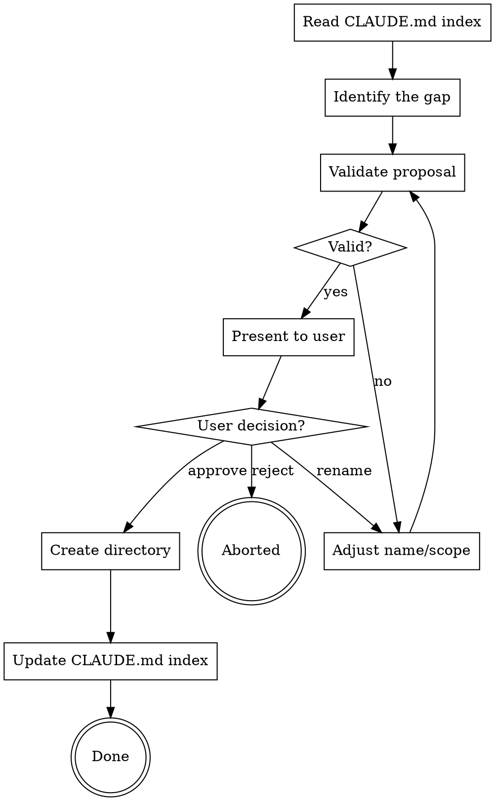

# Propose New Documentation Directory

## Overview

Validate, propose, and create new `.claude-docs/` directories when documentation doesn't fit the standard 4 categories. Can be invoked directly by users or called mid-flow by other project-memory skills.

<HARD-GATE>
You MUST read the CLAUDE.md Documentation Index before proposing any directory. You need to know what already exists to justify why a new directory is needed. If CLAUDE.md has no index, run project-memory:bootstrap first.
</HARD-GATE>

## Checklist

You MUST create a task for each item and complete them in order:

1. **Read CLAUDE.md index** — discover all existing directories and their contents
2. **Identify the gap** — determine why existing categories don't cover this documentation
3. **Validate the proposal** — check naming rules and differentiation from existing dirs
4. **Present proposal to user** — name, rationale, initial files, approve/reject/rename
5. **Apply approved proposal** — create directory and update CLAUDE.md index

## Process Flow



## Step 1: Read CLAUDE.md Index

Find and read the nearest CLAUDE.md to build a map of:
- Which `.claude-docs/` directories exist (standard and custom)
- How many files are in each directory
- What topics each directory covers

This map tells you what's already covered and where gaps exist.

## Step 2: Identify the Gap

A new directory is warranted when one of these triggers fires:

| Trigger | Signal | Example |
|---------|--------|---------|
| **Category mismatch** | A doc/learning doesn't fit reference, conventions, tasks, or troubleshoot | API usage examples, data model docs, integration guides |
| **Directory overload** | An existing directory has 10+ files with divergent topics | `reference/` has architecture, tech-stack, data-models, api-specs, schemas, env-config, auth-flow, caching, logging, monitoring, feature-flags |
| **Project-specific need** | The project's domain warrants a dedicated category | A game engine needing `shaders/`, a data pipeline needing `schemas/` |

For directory overload, the files must be topically divergent — 10 files all about API conventions in `conventions/` is fine; 10 files spanning unrelated domains is not.

## Step 3: Validate the Proposal

Every proposed directory MUST pass these rules:

| Rule | Valid | Invalid |
|------|-------|---------|
| Lowercase, hyphenated | `api-examples/` | `API_Examples/`, `apiExamples/` |
| No nesting | `.claude-docs/api-examples/` | `.claude-docs/api-examples/internal/` |
| Semantically descriptive | `data-models/`, `integrations/` | `misc/`, `other/`, `stuff/`, `new/` |
| Differs from existing 4 | Covers content outside reference/conventions/tasks/troubleshoot | Overlaps heavily with an existing category |

**Why no nesting:** The CLAUDE.md index is a flat routing table. Nested directories add decision layers that increase routing errors. Semantic file naming (`api-examples-rest.md`, `api-examples-graphql.md`) achieves the same organization without the lookup cost. The 200-line file limit already forces granularity.

**Differentiation test:** Articulate in one sentence why none of these work:
- **reference/** — "What is" docs (architecture, tech stack, system design)
- **conventions/** — "How to" docs (coding standards, style guides, workflow rules)
- **tasks/** — Step-by-step guides for common operations
- **troubleshoot/** — Known issues, bug fixes, environment gotchas

If you can't clearly differentiate, the doc probably belongs in one of the existing 4.

## Step 4: Present Proposal to User

Present the proposal in this format:

```
## Proposed New Directory: `.claude-docs/{name}/`

**Rationale:** {Why the existing 4 categories don't cover this}

**Initial files that would live here:**
- `{file-1}.md` — {description}
- `{file-2}.md` — {description}

**Differentiation:**
- Not reference/ because: {reason}
- Not conventions/ because: {reason}
- Not tasks/ because: {reason}
- Not troubleshoot/ because: {reason}

**Options:** approve / reject / rename (suggest alternative)
```

Wait for the user to respond before proceeding.

## Step 5: Apply Approved Proposal

On **approve**:
1. Create the directory: `.claude-docs/{name}/`
2. Add a new section to the CLAUDE.md Documentation Index:
   ```markdown
   ### .claude-docs/{name}/
   ```
3. Return control to the invoking skill (or end if standalone)

On **rename**:
1. Re-validate the new name against Step 3 rules
2. Re-present with updated name

On **reject**:
1. If invoked by another skill, return control — the invoking skill should route to the best existing category instead
2. If standalone, end

## Red Flags

| Thought | Reality |
|---------|---------|
| "This clearly needs a new directory" | Read CLAUDE.md first. The existing dirs might cover it. |
| "misc/ is fine for now" | Generic names become dumping grounds. Be specific. |
| "I'll nest it for organization" | Flat + semantic naming beats nesting for AI routing. |
| "The user won't care about approval" | Always present the proposal. Users know their project best. |
| "10 files isn't that many" | Check if they're divergent. 10 related files is fine. |
