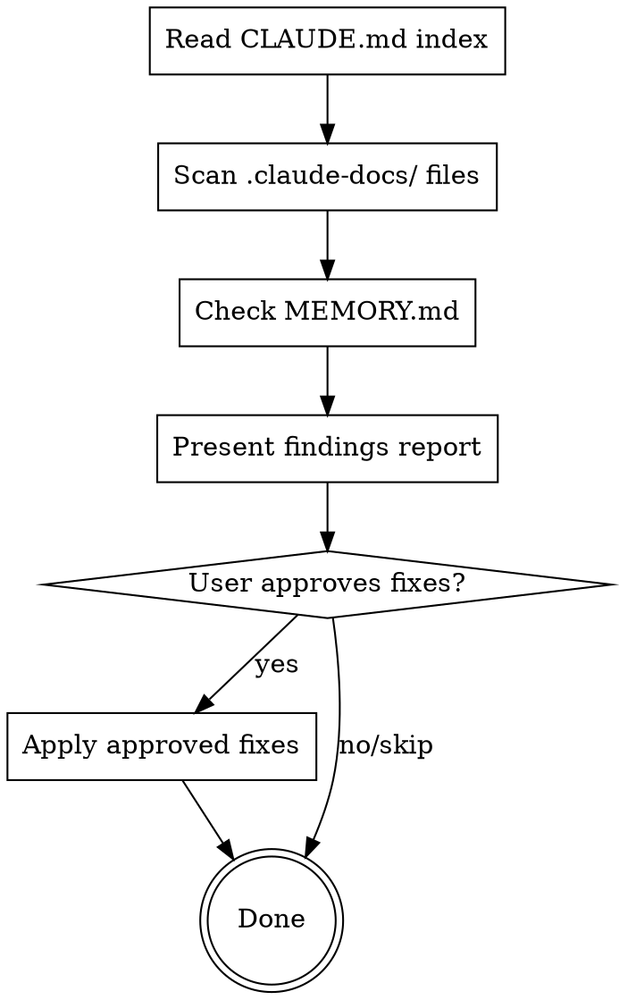

# Review Documentation Health

## Overview

Audit the health of project documentation. Finds oversized files, orphaned docs, broken references, and stale content. Presents a findings report before making any changes.

<HARD-GATE>
You MUST present the full findings report to the user before making ANY changes. Read-then-report, never read-then-fix silently.
</HARD-GATE>

## Checklist

You MUST create a task for each item and complete them in order:

1. **Read CLAUDE.md Documentation Index** — build map of all referenced docs
2. **Scan all .claude-docs/ files** — check for oversized, orphaned, broken refs
3. **Check MEMORY.md** — verify size (<200 lines) and structure
4. **Present findings report** — show all issues with actionable recommendations
5. **Apply approved fixes** — only after user confirms which fixes to apply

## Process Flow



## Health Checks

### Oversized (>200 lines)

Files exceeding 200 lines hurt AI readability. Claude reads files fully each time — smaller files mean faster, more targeted lookups.

**Detection:** Count lines in every `.claude-docs/` file and MEMORY.md.

**Recommendation:** Identify semantic sections and suggest split points.
- `error-handling.md` (280 lines) -> split at HTTP/DB/async sections
- `MEMORY.md` (220 lines) -> compress older "Recent Work" entries

### Orphaned

Files in `.claude-docs/` that are NOT referenced in any CLAUDE.md index. These files exist but are invisible to future sessions.

**Detection:** Compare files found on disk with files listed in CLAUDE.md indexes.

**Recommendation:** Either add to the nearest CLAUDE.md index or remove if obsolete.

### Broken References

CLAUDE.md index entries pointing to files that don't exist. These create confusion when Claude tries to follow the index.

**Detection:** For each path in every CLAUDE.md Documentation Index, verify the file exists.

**Recommendation:** Either create the missing file or remove the broken reference.

### Stale

Files not mentioned in recent MEMORY.md entries and not modified recently. These may contain outdated information.

**Detection:** Cross-reference file topics with MEMORY.md "Recent Work" entries. Check git blame for last modification date.

**Recommendation:** Flag for human review. Do NOT auto-fix stale content — it may still be accurate.

## Report Format

Present findings as:

```
## Documentation Health Report

### Summary
- X files scanned
- Y issues found (N critical, M warnings)

### Critical Issues
- [ ] **Oversized**: `path/to/file.md` — N lines (limit: 200)
  Suggested split: [section A] + [section B]
- [ ] **Broken ref**: `CLAUDE.md` references `path/that/doesnt/exist.md`

### Warnings
- [ ] **Orphaned**: `path/to/orphan.md` — not in any CLAUDE.md index
- [ ] **Stale**: `path/to/old.md` — last referenced N months ago

### MEMORY.md Status
- Lines: N/200
- Structure: [OK / needs compression]

### Recommendations
1. Split `oversized-file.md` into focused sub-files
2. Add `orphaned-file.md` to backend/CLAUDE.md index
3. Remove broken reference to `missing-file.md`
4. Review `stale-file.md` for accuracy
```

## Applying Fixes

After user approves specific fixes:

**For oversized files:**
1. Read the file and identify semantic section boundaries
2. Create sub-files: `{topic}-{subtopic}.md`
3. Update CLAUDE.md index to reference new files
4. Delete the original oversized file

**For orphaned files:**
1. Read the file to understand its content
2. Add to the nearest CLAUDE.md Documentation Index
3. Place in correct index section (reference/, conventions/, etc.)

**For broken references:**
1. Remove the dead reference from CLAUDE.md
2. Or create a stub file if the topic should be documented

**For MEMORY.md compression:**
1. Collapse older "Recent Work" entries into single-line summaries
2. Remove redundant pitfall entries (merge related ones)
3. Verify final line count is under 200

## Red Flags

| Thought | Reality |
|---------|---------|
| "I'll just fix it without reporting" | Hard gate: report first. User must see findings. |
| "Stale docs should be deleted" | Stale != wrong. Flag for review, don't delete. |
| "This orphan is probably useless" | Read it first. It may have valuable knowledge. |
| "200 lines is a soft limit" | 200 lines is the limit. Split without exception. |
